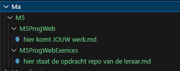
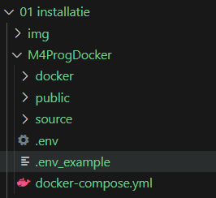
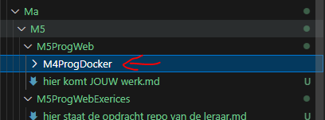
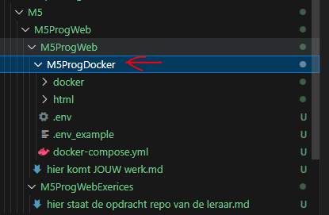

# docker

we hebben nu een nieuwe docker nodig voor dit vak

- ga naar de directory M5ProgWeb
    >
- daar hebben we een directory staan:
    >

## kopieer
- kopieer die naar je M5ProgWeb directory
    >

## hernoemen
- hernoem M4ProgDocker naar M5ProgDocker
    >

## klaar

ga naar de volgende opdacht