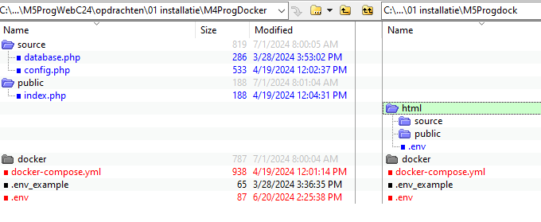
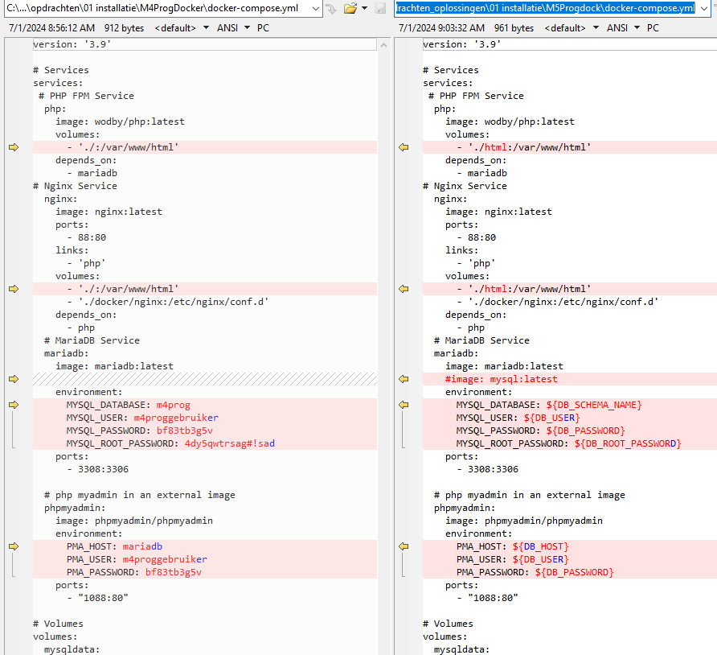
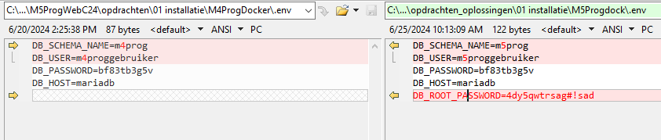
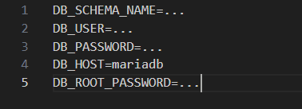
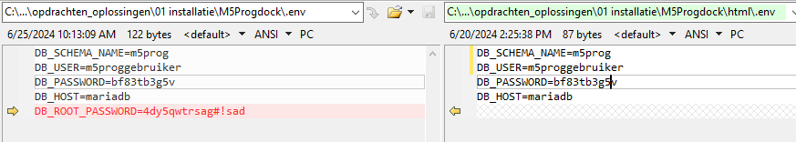
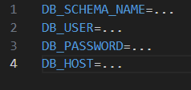

# docker

de M4 docker was nog niet veilig dat gaan we aanpassen

- maak een html map aan
- zet source en public in in die html file
- maak daar een .env file aan
> 

## docker compose aanpassen
- open docker-compose.yml in visual studio code
- verander de volgende dingen
    > links is oud rechts is nieuw!
>

## .env aanpassen
- open de .env die naast de .env_example staat
- verander de volgende dingen
    > links is oud rechts is nieuw!
>

- pas nu de wachtwoorden aan
    - wel goede wachtwoorden!!
    
## .env_example aanpassen
- open de .env_example file
    - zorg dat die er zo uitziet:
>

## html/.env aanpassen

- open de .env die naast in de html directory staat
- kopieer alles uit de .env (naast .env_example) BEHALVE DB_ROOT_PASSWORD
    > rechts is de .html env
>

## html/.env_example aanpassen
- open de html/.env_example file
    - zorg dat die er zo uitziet:
>

## klaar

ga naar de volgende opdacht