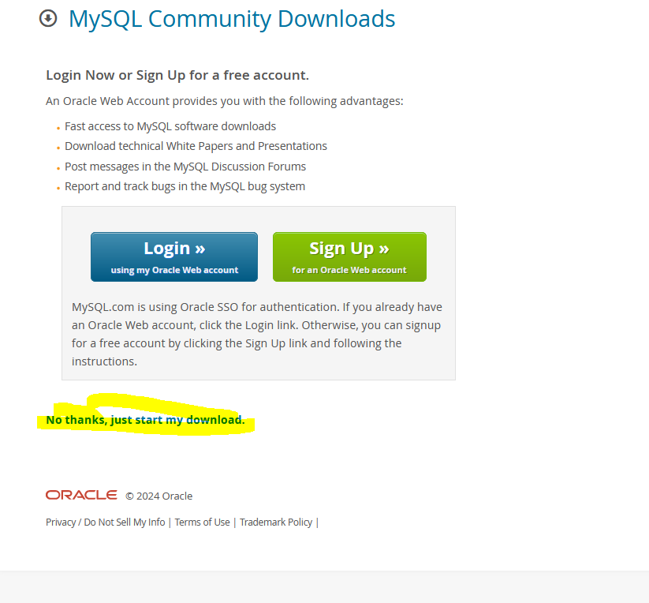
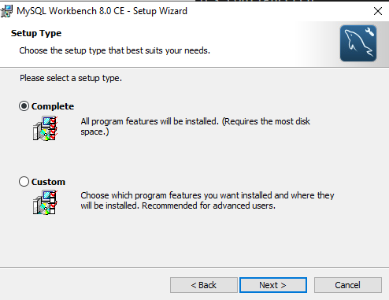
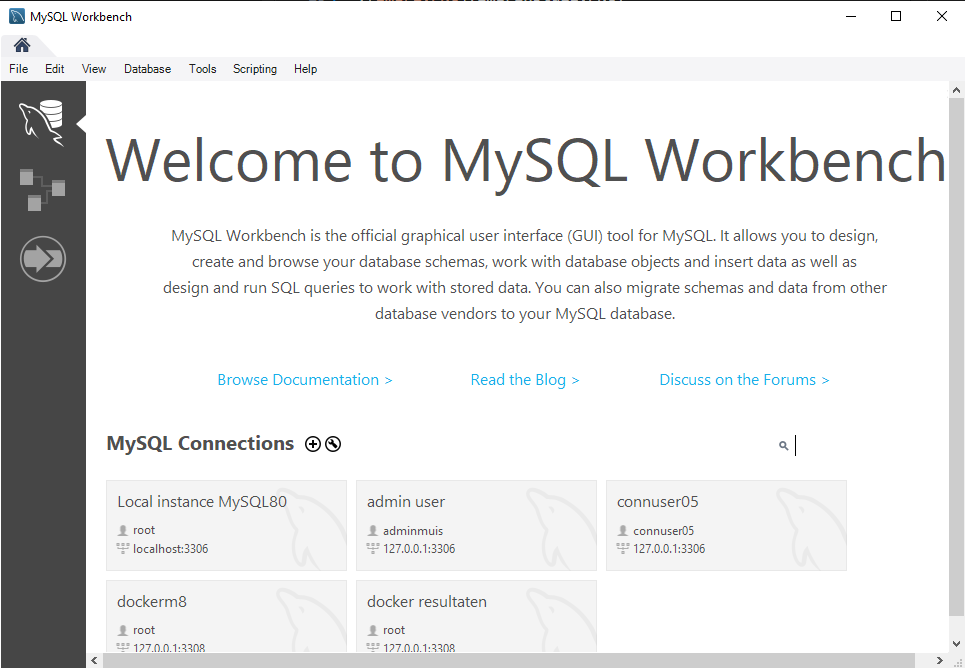

# Mysql lokaal

We gaan nu onze ontwikkelomgeving inrichten. Docker hebben jullie al, wat wij nog nodig hebben is mysql workbench

## download

- https://dev.mysql.com/downloads/workbench/ `workbench`

>

* !!! je hoeft niet in te loggen zoek `no thanks just start my download`

>

## installer starten

- start de installer
- doe nu `rustig` stap 1-10 hieronder, zodat je geen fouten maakt

## installer stappen

- kies `complete`

> 
- wacht tot de installer klaar is
- start workbench up

> 

## klaar!

nu ben je er klaar voor, ga naar de volgende opdracht
