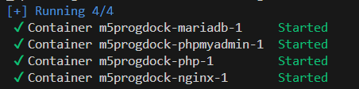
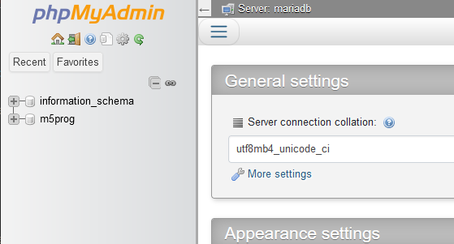

## docker maken en starten

- start je docker desktop op

- ga nu in je commandprompt/terminal naar de directory `M5ProgDocker`
    > dus waar `docker-compose.yml` in staat
    
    > 

- type:
    - docker compose up -d
    - wacht tot alles klaar is:
        >

## html testen

- open de de mginx 88:80
    > 
- controlleer of je het volgende in je browser krijgt
    > 

## phpmyadmin testen
- open de phpmyadmin container in je browser

    > 
- controlleer of je het volgende in je browser krijgt
    > 

## klaar!

nu ben je er klaar voor, ga naar de volgende opdracht
