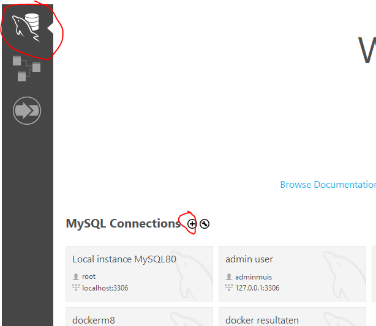
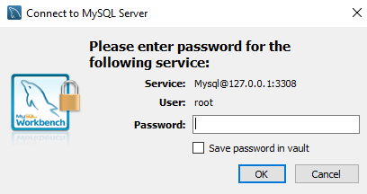
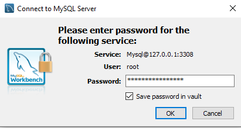
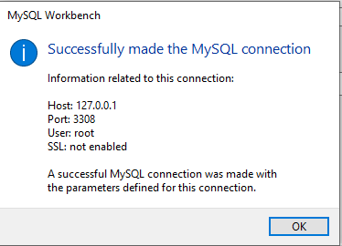
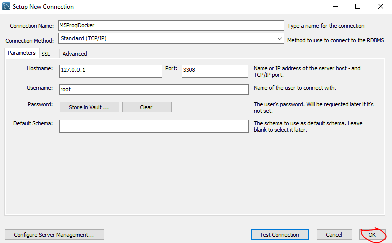
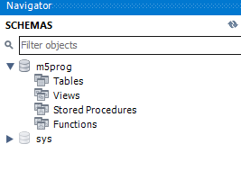

## Users

we gaan nu kijken of de rechten kloppen

## workbench

- start mysql workbench
    - click op de dolfijn
    - dan op de +
>

## inloggen in docker

- je krijgt nu het new connection scherm
    - vul het in zoals hieronder:
    >
- open je .env in visual studio code
    - daar staat je root wachtwoord
- druk nu, in workbench, op
    - test connection 

## test connection scherm
- je krijgt dit scherm:
    >
- vul je root wachtwoord in *(zie je .env file)*
    - vink het volgende aan
        - save password in vault
        >
    - druk op ok
        - je krijgt een warning, dat is ok
            - click op continue
        >
        - daarna krijg je
        >
        - click op ok
    - click nu nog een keer op ok
        >

## connectie openen

- nu heb je een M5ProgDocker connectie

>
- click daarop
    - click de warning weg
- kijk nu zit je in de admin interface en zie je je m5prog schema
>

## klaar!

nu ben je er klaar voor, ga naar de volgende opdracht