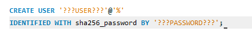
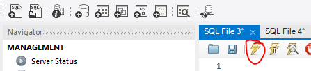

## Users

- lees deze uitleg:

```
je wil `NOOIT` en ook echt `NOOIT` je `root login` gebruiken in een application
Wat is daar de oplossing voor?

gebruikers per `APP` of misschien zelfs per `Deel` van de `App`

op dit moment is de login van onze APP (php) hetzelfde als die van phpmyadmin
> Dat zijn teveel rechten!!

```
## workbench

- start mysql workbench
- log in op je M5ProgDocker met je `root`

## Navigator tabs

in mysql workbench heb je 2 tabs in de `navigator`:
- administration
- schemas
- click op de administration tab
    > 

## Rechten check

- click op `users and privileges`

    >
- click de m5proggebruiker aan
    > 

## nieuwe gebruiker maken, voorbereiding

- open je html/.env file (die zonder de db_root_password)
- pas de gebruiker aan:
    - noem deze `m5progphp`
- pas het wachtwoord aan
    > Mijn voorbeeld:  
    > 

## nieuwe gebruiker maken

- in je workbench:
- click op de `+sql` knop
    > 

- lees deze uitleg:
    ```
    - we gaan nu een gebruiken met SQL aan maken
        > (helaas werkt het via de user interface niet meer)
    ```
- type de volgende sql in je nieuwe sql window:
        > 
    - vervang ???USER??? met de user in je .env (onder html)
    - vervang ???PASSWORD??? met de password in je .env (onder html)
    - druk op de bliksem schicht
        > 


## klaar

ga naar de volgende opdacht