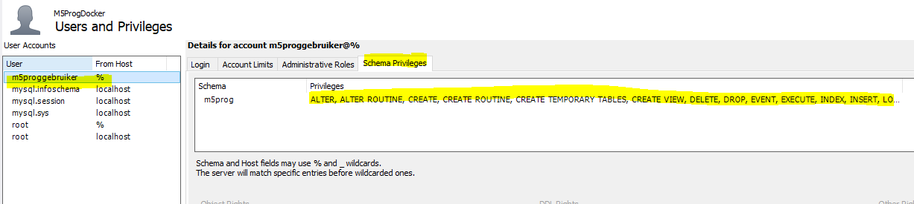
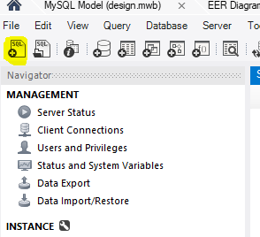
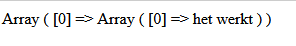

## admin & schema privileges


- lees deze uitleg:
    ```
    * wij willen nu de rechten geven aan deze gebruiker op ons nieuwe schema `usertest`
    * we zitten niet aan de administrative roles tab!! dat is globaal over de hele database en dus `gevaarlijk`
    ```

#### refresh
- doe het user scherm weer dicht
    > 
- open daarna het scherm weer (soms laat workbench de users niet meteen zien)
    >


#### privileges aanpassen met sql 

> helaas de userinterface werkt niet meer, dus even via sql

- lees de sql hieronder:
    >
    - zie je die ???grants??? daar kan je de rechten invullen

- maak een connectie met je docker via workbench
    - click op de `+sql` knop
        > 
        - type de sql over en:
            - vervang ???grants??? met select

- lees deze uitleg:
    ```
    * dit is omdat deze user alleen voor `1 app` is en dus geen rechten nodig heeft op de database of andere schemas. Dit is het `least priviledge` principe: alleen wat je minimaal nodig hebt niets meer

    - meer hebben we niet nodig, maar gebruikelijk voor een app is:
        - select
        - delete
        - insert
        - update
        - execute

    ```

- lees deze uitleg:
    ```
    * mogelijk dat je dus voor 1 app meerdere users hebt, afhankelijk van de rollen binnen de app bv:
    * een admin rol mag insert & delete
    * een lees rol mag alleen select
    ```

## testen

- start je m5progdock container opnieuw op
- open de index.php
    > 
