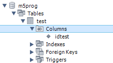
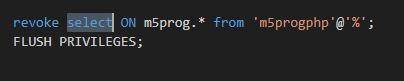
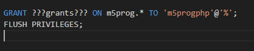

## Users

we gaan nu kijken of de rechten kloppen

## workbench

- start mysql workbench
- log in met je M5ProgDocker connection

## table maken

- maak in `m5prog` een table `test`
- geef deze 1 colomn
    >

## inloggen met de gebruiker

- ga naar de home tab (het huisje)
- click de `+` en vul je `m5progphp` gebruiker in
- zet de poort op 3308
- test de connectie
- open nu de connectie

## select

als het goed is mogen we selecteren
- select alles van de table `test`

krijg je geen fouten? mooi! dan werkt het
- maak een screenshot van het resultaat
    - sla deze op onder je M5ProgWeb map
        - met de naam `02 appusertest.png`

## Admin

- maak een nieuwe connection maar dan met root naar je docker
    > elke tab die opend heeft zijn eigen connection en dus eigen rechten!

- geef de gebruiker `m5progphp` nu een `insert` (gebruik weer grant)
- haal nu select weg dat doe je met een revoke:
    > 

## select

als het goed is mogen we nu niet meer selecteren
- select alles van de table `test`

krijg je een fout? mooi! dan werkt het
- maak een screenshot van het resultaat
    - sla deze op onder je M5ProgWeb map
        - met de naam `02 appusertest nope.png`

## herstellen van de rechten

- geef meer rechten:
    - select
    - delete
    - insert
    - update
    - execute
        >
    - zie je die ???grants??? daar kan je de rechten invullen
        > scheid ze met kommas!
## extra:

- pas index.php aan, en select daar alles uit test
- check wat er gebeurt!

## git

commit naar je git repository voor de vak!