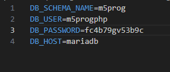

## Users

- lees deze uitleg:

```
je wil `NOOIT` en ook echt `NOOIT` je `root login` gebruiken in een application
Wat is daar de oplossing voor?

gebruikers per `APP` of misschien zelfs per `Deel` van de `App`

op dit moment is de login van onze APP (php) hetzelfde als die van phpmyadmin
> Dat zijn teveel rechten!!

```
## workbench


 ```
 
CREATE USER 'sha256user'@'%'
IDENTIFIED WITH sha256_password BY 'password';
GRANT select,insert,update ON m5prog.* TO 'sha256user'@'%';
FLUSH PRIVILEGES;

```

- start mysql workbench
- log in op je M5ProgDocker met je `root`

## Navigator tabs

in mysql workbench heb je 2 tabs in de `navigator`:
- administration
- schemas
- click op de administration tab
> 

## Rechten check

- click op `users and privileges`

>
- click de m5proggebruiker aan
> 

## nieuwe gebruiker maken

- open je html/.env file (die zonder de db_root_password)
- past de gebruiker en het wachtwoord aan
> 

- in je workbench:
- maak nu een `gebruiker` door op `Add Account` te clicken
- noem deze `m5progphp`
- gebruik het wachtwoord uit je .env file van eerder

## admin & schema privileges


- lees deze uitleg:
```
* wij willen nu de rechten geven aan deze gebruiker op ons nieuwe schema `usertest`
* we zitten niet aan de administrative roles tab!! dat is globaal over de hele database en dus `gevaarlijk`
```

- click op de `schema privileges` tab
> 
- hier staat een `Add Entry ...` knop click daarop
- in de popup selecteren we `Alleen` ons schema
> 

- lees deze uitleg:
```
* dit is omdat deze user alleen voor `1 app` is en dus geen rechten nodig heeft op de database of andere schemas. Dit is het `least privilidge` principe: alleen wat je minimaal nodig hebt niets meer

```
## rechten 
- Vink in `object rights` alleen `select`
- meer hebben we niet nodig, maar gebruikelijk voor een app is:
    - select
    - delete
    - insert
    - update
    - execute
- lees deze uitleg:
```
* mogelijk dat je dus voor 1 app meerdere users hebt, afhankelijk van de rollen binnen de app bv:
* een admin rol mag insert & delete
* een lees rol mag alleen select
```

## testen

- start je m5progdock container opnieuw op
- open de index.php
> 


## klaar

ga naar de volgende opdacht