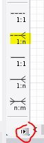

## 1:n

- lees deze uitleg:
```
We hebben een adres en een persoon

laten we nu even uitgaan van dat 1 persoon maximaal 1 adres heeft
en er meerdere personen op een adres kunnen wonen.

dat is een 1 op N (1:N) relatie

die gaan we aan maken in ons diagram
```


## relaties aanmaken

gebruik het knopje 1:N om een relatie te leggen

- click op het knopje
>
> let op als het scherm te klein is zit de knop verstopt, maak het scherm groter of click het rood omcirclede pijltje
- click op de persoon table
- click op de adres table

## extra colomn?

- bekijk persoon
    - zie je de extra colom?

- lees deze uitleg:
```
Die was nodig om een koppelwaarde in op te slaan
Verder kan je bij de tab `foreign keys` van de table editor de relatie ook zien
```

### inleveren
- sla het diagram op in je `Db opdrachten` map
- maak een `screenshot` van het `diagram` en zet dat in je `Db opdrachten` map


## git

commit je screenshot & model naar je git repository voor de vak!
