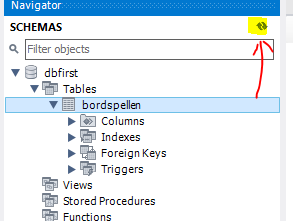

## Database naar sql

- lees deze uitleg:
    ```
    Soms gebruikt je niet een diagram maar zet je de database in elkaar tijdens de ontwikkeling in elkaar.
    Dan moet je ook je sql bewaren!

    ```

## schema maken

> Doe dit `NIET` in de designer maar direct op de database via de `schema` tab

> 

- open je workbench
- ga naar de schema's tab
- maak een nieuw schema:
    - met de naam `dbfirst`
        > 

## tabel
- maak een nieuwe file in je `Db opdrachten` map:
    - bordspel.sql
- maak nu deze tabel na in `dbfirst`
    > 
- druk op apply
    > LET OP!! click de SQL/het resultaat window nog niet weg
    - bewaar de sql die je nu ziet in:
        - bordspel.sql
            > 

## controleren
- check of je nu dit hebt:
    > 

- zie je het niet?
    - refresh even
        > 
    
## git

commit naar je git repository voor de vak!
