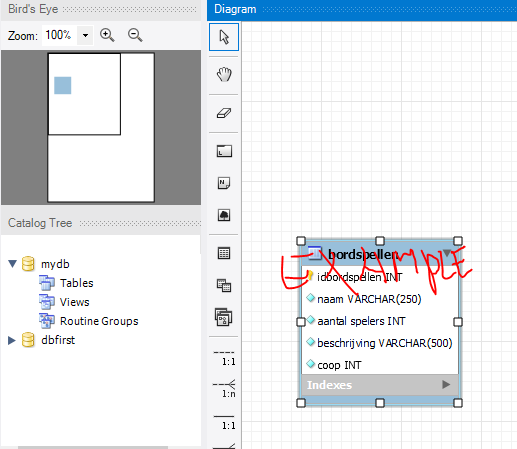

## reverse engineer

- click op `database`
    - click op `reverse engineer`
    > 

- start de reverse engineer wizard
- probeer deze zelf uit
    > 
- zorg ervoor dat je een diagram hebt aan het eind
- sla het diagram op en maak een screenshot
    > 

## data

- lees deze uitleg:
    ```
    Vaak als je ontwikkeld heb je data die nodig is. Denk bijvoorbeeld aan 
    categorieen, of product types. Die data is nodig als `initieele` data, zonder die data werkt er niets.
    ```
- Vul jouw bordspel tabel nu met wat data.

## data export

lees `https://dev.mysql.com/doc/workbench/en/wb-admin-export-import-management.html`

we gaan nu de data exporteren naar sql.
- zorg ervoor dat jouw data naar een .sql file geexporteerd wordt
    - sla dat script op in de map voor dit vak
- open je export script, wat zie je allemaal in dit script?


## git

commit je script, diagram en screenshot naar je git repository voor de vak!