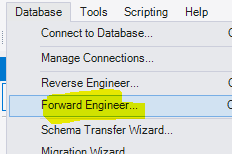

## Diagram naar database


## SQL generation

- lees de volgende uitleg:
    ```
    als we een diagram hebben kunnen we vanaf daar sql genereren.
    Vaak heeft elke tool een eigen naam hiervoor, soms moet je dus even zoeken

    Om van jou diagram sql te maken gebruiken we de feature `forward engineer`
    ```

- open `mysql workbench`
- open het diagram van `gameraccount` van opdracht `03 database maken`

## forward engineer

- click op `database` op de `toolbar`
    - click op `forward engineer`
        >

## opties

- als eerst krijgen we onze connectie opties
    - zet de connection op M5ProgDocker
        >

- het volgende scherm is `options` alles staat soort van goed
- lees de opties door, 
    - snap je wat ze doen?

- lees de volgende tip:
    ```
    !!! soms is de `DROP objects before each CREATE object` een handige optie
    * bv voor development om je database uitrol te testen.
    ```
- click nu op next

## select objects

- laat staat zoals het was
- bedenk je wanneer je hier dingen zou aanpassen en waarom
- click nu op next

## review


- gebruik de save to file optie om de sql op te slaan
    - doe dit in de map voor dit vak

## commit

- click nu op next, nu wordt het SQL script uitgevoerd op de database
- kijk of er een schema + tables gemaakt zijn
    >

## opnieuw uitrollen

- probeer nu de sql file, die je eerder bewaard hebt, te gebruiken om de database opnieuw te maken


## conclusie

- lees het volgende:
    ```
    - met sql scripts kan je heel makkelijk opnieuw een database maken!
    - dit is hoe we 99% van de tijd database in productie uitrollen (`zonder de drop schema ^^`), met scripting
    ```
## git

commit je sql script naar je git repository voor de vak!