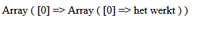
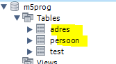
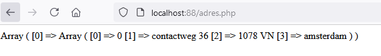

## connection

- lees deze uitleg:

```

> structuur
Onze index.php maakt gebruik van de database.php file
database.php gebruikt config.php
en config.php lees de .env in (in de html map)

in die .env verwijzen wij nu naar DB_SCHEMA_NAME=m5prog

> schemas
m5prog is dus het enige schema wat wij nu kunnen gebruiken

wij hadden nog andere schemas gemaakt, willen we die gebruiken moeten we de .env aanpassen OF andere oplossingen bedenken

```

## testen

- open index.php in je browser via docker
    - nu zien we onze basic select
    >

### forward to m5prog

- open je diagram (uit 04 db design) met de adres en persoon tabel
- gebruik de forward engineer feature:
    - zorg dat je de tabellen adres en persoon in m5prog krijgt
    >

### data

- zet 2 adressen in de adres tabel:
    - het media college adres
    - het adres van een restaurant uit de buurt
- zorg dat je de insert statement bewaard in een sql file 
    - in de map van dit vak

### adressen

- maak onder html/public een nieuwe php file:
    - adres.php
- zet daar alles in van index.php

- pas de select aan naar:
    - een select die alles van adres selecteerd

> 

### personen

- bouw nu zelf een extra select die personen laat zien

## git

commit naar je git repository voor de vak!
