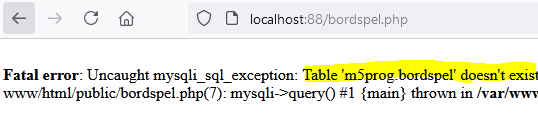
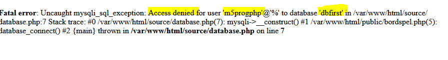
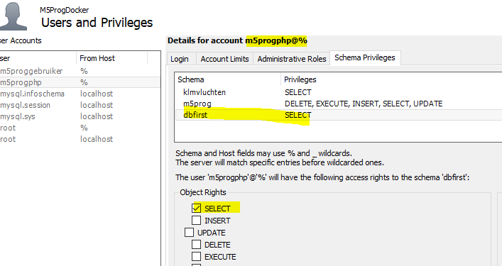
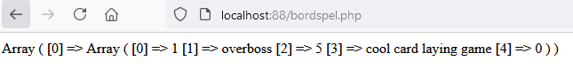

## connection


- lees deze uitleg:

    ```

    > structuur
    Onze index.php maakt gebruik van de database.php file
    database.php gebruikt config.php
    en config.php lees de .env in (in de html map)

    in die .env verwijzen wij nu naar DB_SCHEMA_NAME=m5prog

    > schemas
    m5prog is dus het enige schema wat wij nu kunnen gebruiken

    wij hadden nog andere schemas gemaakt, willen we die gebruiken moeten we de .env aanpassen OF andere oplossingen bedenken

    ```

## bordspellen data

- open je bordspel tabel ( opdracht 05/02 reverse engineer)
    - zet daar data in
        - zorg dat je de insert statement bewaard in een sql file 
            - in de map van dit vak

## php

- maak een nieuwe php file:
    - bordspel.php
- select alles uit de bordspellen tabel

- test of dit werkt
    - open dus bordspel.php 
        > het zou niet moeten werken

- bedenk je waarom het niet werkt
    > 

## connection naar ander schema

- COMMIT je werk nu tussentijds
- open je .env file in de html map
    - pas DB_SCHEMA_NAME aan naar het schema waar je bordspel tabel in staat
    - test opnieuw
        - nog een fout?
            > 

## oplossen   

- pas in workbench onze gebruiker aan
    > 

- probeer het nogmaals!
    > 

## andere pagina

- open nu je adres.php
    - nu is deze weer omgevallen
- herstel .env naar m5prog als schema
    > HINT: als je de tussentijdse commit goed gedaan hebt, kan je met git de veranderingen ongedaan maken. 

- lees het volgende:
    ```
    als een applicatie meerdere schemas gebruikt dan moeten we onze manier van connecten veranderen zodat we meerdere schemas connecties kunnen ondersteunen
    ```

## git

commit naar je git repository voor de vak!
