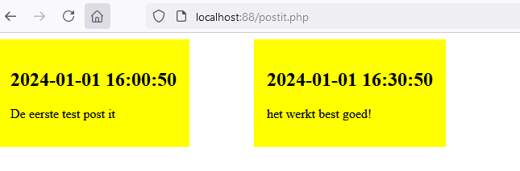

## post it page

- lees deze uitleg

```
we hebben een klant

deze wil graag een pagina waar post its op staan
het eind resultaat moet zijn dat de klant post its kan maken, verwijderen en editen

dat is veel werk dus voor deze eerste sprint hebben wij de volgende taken:
- database design maken
- test post its in de database zetten
- het database script opslaan

- post it pagina maken met php
- zorgen dat de post its netjes op het scherm komen

```

- lees deze tips:
    - denk terug aan m4prog
        - het mixen met php
        - hoe haal je rijen uit een tabel op
        - hoe haal je data uit die rij
        
## aan het werk!

- gebruik nu de dbdesigner om de database te maken
    - daarna maak je de data en de php pagina
> 
## git

commit naar je git repository voor de vak!
