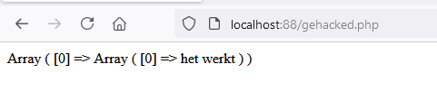
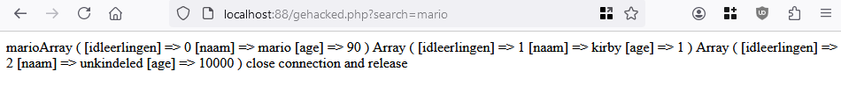

## Php

- maak een php file `gehacked.php` 
- maak een database connectie in je php
    - gebruik je code uit `index.php` 
- test je database connectie
    - Zie je een fout? of een connectie bericht?
    > 

## Selecteren

- maak deze function in je `gehacked.php`
> 

- test je `gehacked.php`
    - roep dus FindLeerling aan!
> 


## Query string

- lees deze uitleg:

```
Kijk eens naar deze duckduckgo url:
>

dit is nadat ik gezocht heb.
> duckduckgo maakt van mijn zoek `relaxing snes music` een querystring:
> `https://duckduckgo.com/?q=relaxing+snes+music`
> zo geeft de browser data van javascript/html door naar de server (php of iets anders)
```

## zelf doen!

- lees deze uitleg:
```
Als we achter de url `http://localhost:88/gehacked.php` wat zetten:
`http://localhost:88/gehacked.php?search=sonic`
dan hebben we een query string gemaakt achter de url, net als duckduckgo.
> Hier staat nu een variable `search` met waarde `sonic`

```

- open `gehacked.php`
- zet boven in het volgende erbij:
```
$search = $_GET["search"]; 
```

- lees deze uitleg:
```
> hier halen we nu de waarde `sonic` uit de url en stoppen die in `$search`  
> `$_GET` is een speciale variable van `php` waar alle dingen in de query string in staan
```

- echo nu `$search`
>
- open in je browser:
    - `http://localhost:88/gehacked.php?search=sonic`
    - `http://localhost:88/gehacked.php?search=mario`

> dan zie je zo'n soort resultaat:
>

## hele query string printen

- voeg nu in je `php` het volgende toe:
 - `print_r($_GET);`
- ga in je browser naar:
    - `http://localhost:88/gehacked.php?search=sonic&badeend=JA&baanje=snelrenner`
> dan krijg je dit te zien in je browser:
>