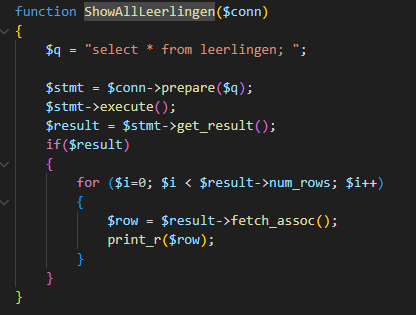

## SELECT WHERE

Laten we eerst eens alle leerlingen selecteren:
- maak een kopie van deze function in je `gehacked.php`
>
- noem deze FindLeerling

- voeg een `where` toe
>

- Roep nu de function `FindLeerling` aan met:
`($conn, $search)`

- nu zie je de leerling die gevonden is:
>

## test

- lees deze uitleg:
```
als je nu naar `http://localhost:88/gehacked.php?search=mario` (url kan mogelijk anders zijn in jou geval) gaat gaat de app zoeken in leerlingen naar mario
```

- verander search=mario naar iets wat jij in je table hebt staan
> probeer dus een andere leerling te laten zien

## hack it

- maak nu van `mario`: `mario'`
- zie je wat er gebeurt? nu veroorzaak jij een fout in de sql. 
> Fout boodschappen kunnen hackers informatie geven
> 
- maak een screenshot van de resultaten (`geef een goede naam!`)

- maak nu van `mario` : `mario' or naam like 'sonic`
- meer info? cool!
    - je hebt nu 2 leerlingen in beeld...
>
- maak een screenshot van de resultaten (`geef een goede naam!`)

- maak nu van `mario` : `mario' or age > 0 or naam = 'mario`
- alles gekregen, of op specifieke dingen zoeken? kan!
- maak een screenshot van de resultaten (`geef een goede naam!`)

## DANGER!!

- lees het volgende:
```
zie je het gevaar? met een beetje puzzelen kan je veel statements proberen en data vissen.
als iemand `multi_statements` toelaat, wordt het NOG `gevaarlijker`.

```
- maak een `.txt` file
- zoek uit wat een `multi_statement` is met `mysqli`
- schrijf in je eigen woorden op wat het is en waar het gevaar volgens jou zit


## GIT

commit:
- de screenshots 
- de `.txt` file
- je php files