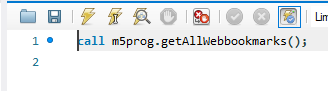
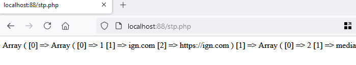

## STP vanuit PHP

- lees het volgende:
```
tja je moet een STP ook gebruiken toch? dus vanuit php
```

## sql bekijken

- voer de STP uit opdracht `01 create stp select.MD` nog een keer uit
- zie je de sql? die `call`, `()` etc?
> 
- die kan je ook in php als sql met je mysqli gebruiken

## prepared statement & call

- maak een php file `bookmarks.php`
- maak een connectie met je docker
- maak de code zoals je die gewend bent (wel met een prepared statement!)
- schrijf voor nu even je `select` als `query` (gebruik de select uit de STP)
- `print_r` de resultaten
- die select kan je nu vervangen door de code die je bij `sql bekijken` zag staan

## test

- test of je nu resultaten krijgt
> 


## GG

- GG je hebt nu een STP gebruikt ipv sql in je code


## git

commit je files naar je git repository voor de vak!