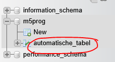

## directories maken

- ga naar je M5ProgWeb map
    - open je docker 


        >

    - maak ook even de sql file aan

## compose file

- open je docker-compose.yml
- zoek je database service

- bekijk dit plaatje, en gebruik zet dan de regel daaronder bij de database service:
    > 
    - deze regel:
        ```
        - ./docker/sql/:/docker-entrypoint-initdb.d
        ```

## Tabel klaarzetten


- zet in je `00 scaffold db.sql` file deze sql:
    ```SQL
    CREATE TABLE IF NOT EXISTS `automatische_tabel` (
    `id` INT NOT NULL AUTO_INCREMENT,
    PRIMARY KEY (`id`),
    UNIQUE INDEX `automatische_tabel_UNIQUE` (`id` ASC) VISIBLE
    );
    ```


## Database opnieuw
- lees:
    ```
    omdat deze scripts maar 1 keer gedraaid worden zullen deze niet met een nieuwe compose gedraaid worden

    de regels:
    - ze draaien als je de container voor het eerst maakt
    - als de container al bestond gebeurt er niets

    - wil je ze opnieuw draaien dan moet je de container eerst weggooien
        - LET OP: dan verlies je je tabellen in je database
    ```

- aangezien wij nog geen tabellen in de database hebben doen we dat nu
    - lees:
    ```
    - als je wel tabellen hebt en het is een ontwikkel of test database kan je het doen als:
        - je de tabellen netjes gescript hebt (.sql files)
        - je initieele en test data ook netjes gescript hebt
    ```
- maak je container opnieuw met docker compose up

## test

- open je phpmyadmin
    - kijk of daar nu de tabel staat:
        > 

## klaar

ga naar de volgende opdacht